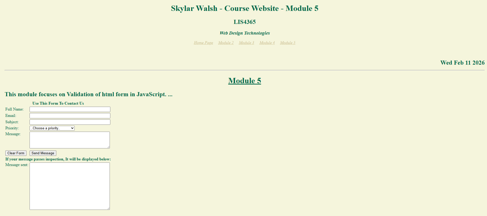
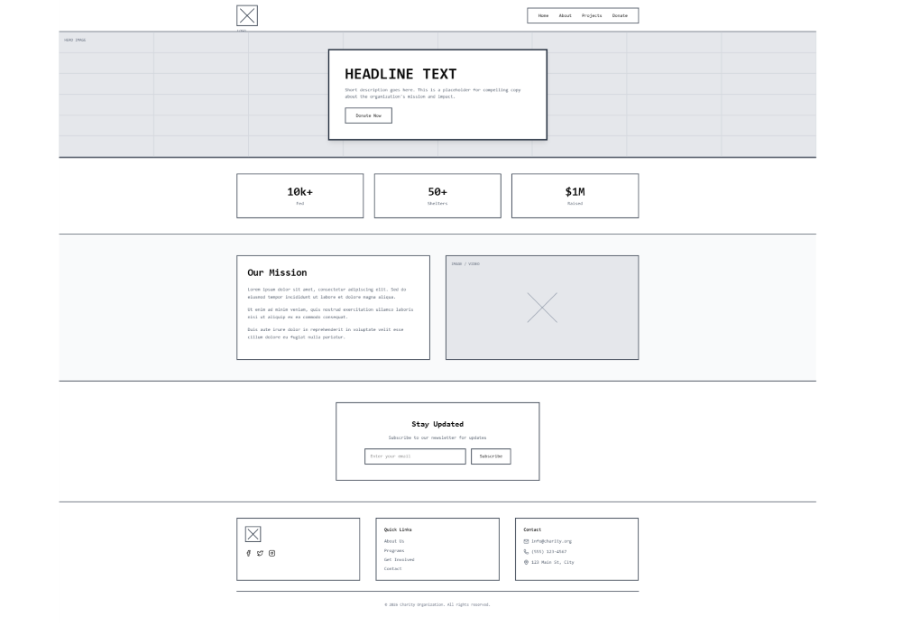

```{r setup, include=FALSE}
knitr::opts_chunk$set(echo = FALSE)
```

Here is a link to the module 5 webpage:

<https://skylarwalshlis4365.infinityfree.me/Module5.html>

These are responses to our module 5 tasks:

For the Web Programming

1.  The instructions asked us to design our own HTML form and apply JavaScript principles to validate and examineuser input. Then, post it on my website. I completed this task, and the link above directs visitors to a webpage with a form that looks like this: {width="900"}

For the Web designers

2\. Design your own wireframe by using any of the software/app you prefer. Your design needs to incorporate boxes, logo and footer. In your blog, provide in depth discussion to the rationale and implementation of your design process.

This is an image of my wireframe that contains a variety of content elements, including, in this order, a header, hero section, stats, main content, a call to action, and a footer:

This wireframe focuses on the layout of a non-profit organization.



In this discussion of the rationale for my design process, the wireframe focuses mainly on user interactivity. It is divided into sections for various content elements, creating a trustworthy and engaging layout. By placing the logo, which in this case is a square with an X, in the top-left corner and adding an interactive button in the hero section (Donate Now), the layout clearly shows the non-profit's goal: fundraising. The hero section uses a large box with a full-width background imageto create an emotional connection with the audience, while the three small horizontal "Impact Stats" boxes provide engaging, quantitative facts about the charity. With this structure, the layout will help visitors understand the organization's mission statement and its efficiency while visiting the page.

The implementation of my design process for this wireframe relies on an appropriate zoom level and marginal lines, as the design should be easily organized and support devices of any screen size that use a web browser. The clear separation of content into individual boxes, such as the main content and the call to action, creates a flow that avoids overwhelming the reader with too much information. The footer contains legal information, contact details, icons, and links arranged in separate boxes to maintain clarity. By making white space and separation between sections of the layout a top priority in my design, I reduce cognitive load in my wireframe and ensure it has purpose, making it easier for donors and participants to interact with the user-centric design and take constructive action.
