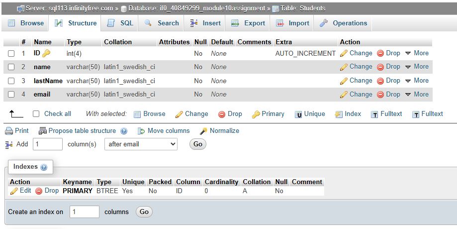
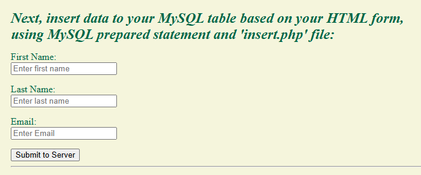
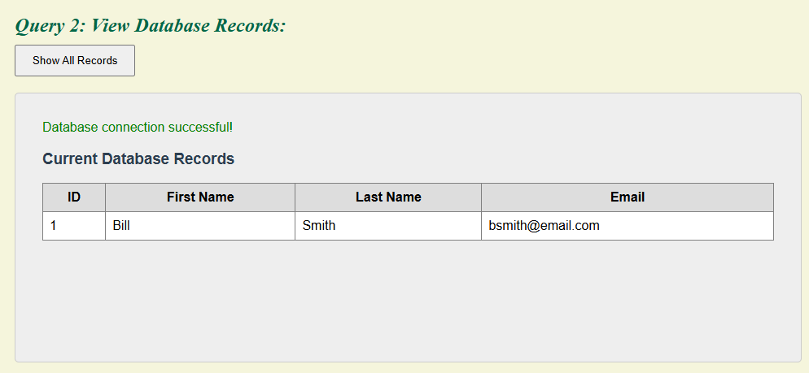

```{r setup, include=FALSE}
knitr::opts_chunk$set(echo = FALSE)
```

## Here are my responses to our module 10 tasks

## Step 1

In your infinityfree.net and your phpMyAdmin:

Click on phpMyAdmin, and create 'Students' table.

I started by accessing my InfinityFree hosting account, then opened the
control panel. I then navigated to the databases section and selected
the MySQL databases icon. Finally, I began naming and creating a new
'Students' table that included four columns: ID (primary key auto
increment), name, lastName, and email.



## Establish and test database connection

Next, I created a 'db_connect.php' file to establish and test the
connection to my database:


## Next, I inserted data to my MySQL table based on an HTML form.

I decided to use an 'insert.php' file that utilizes prepared statements
and PDO (PHP Data Objects).



## Next, I inserted data to my MySQL table based on an HTML form.

Finally, I created another .php file that runs a MySQL SELECT\* query to
print the records from the database table to the webpage using prepared
statements and PDO (PHP Data Objects). I found it very interesting to
work with the PDO objects that would obtain input values from the web
form and store them in local variables that the .php file can use to
work with the data in my database and return a final object to be
displayed on the webform.



Here is a link to the module 10 webpage that runs the .php file test:

<https://skylarwalshlis4365.infinityfree.me/Module10.html>
